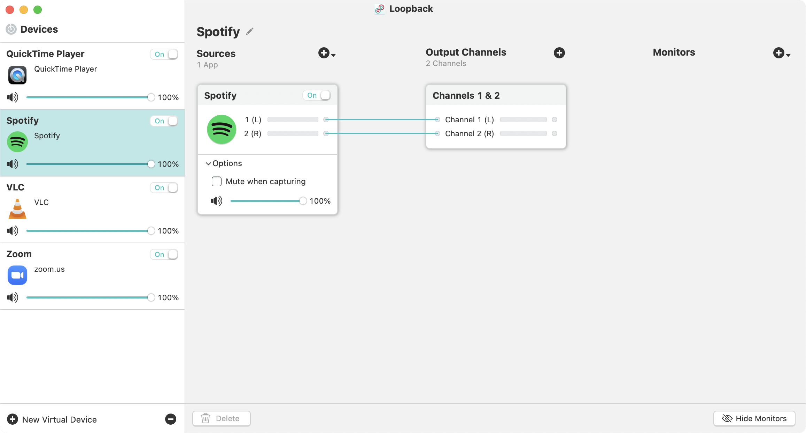
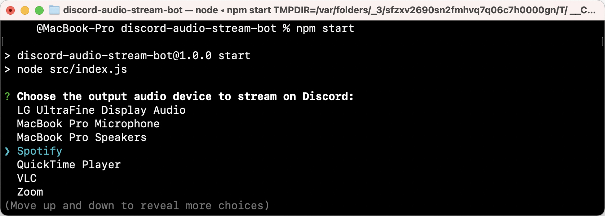

Discord Audio Stream Bot
========================

A small utility that captures audio from a local source and broadcasts it to a Discord server. DASBot requires several dependencies and has been developed and tested on macOS.

To use this Discord bot, you would need to:
1. Install the dependencies
2. Configure this bot to use your Discord bot token
3. Begin to stream audio on Discord

## Install Dependencies
Before we configure and run DASBot, you would require [NodeJS](https://nodejs.org), [FFmpeg](https://ffmpeg.org), and a virtual device driver such as Rogue Amoeba's [Loopback](https://rogueamoeba.com/loopback/). Follow the directions below to get started.

1. Install [Homebrew](https://brew.sh) to run the commands below
2. Install FFmpeg by running `brew install ffmpeg`
3. Install NodeJS by running `brew install node`
4. Tap into the DASBot directory with `cd discord-audio-stream-bot`
5. Install project dependencies by running`npm install`

## Configure Loopback Device
If you have not installed Rogue Amoeba's [Loopback](https://rogueamoeba.com/loopback/), now is the time to do so. The instructions below assumes that you have already installed and opened the application. Spotify will be used in this example.

1. In the bottom left corner, click __New Virtual Device__
2. With __Loopback Audio__ highlighted, rename the device to __Spotify__
3. Click on the __Pass-Thru__ source, and then __Delete__
4. To the right of __Sources__, click __+__ > __Select Application...__
5. Select __Spotify__ and then click __Open__

## Configure Application
Below are the instructions on how you can create a Discord bot and add the Discord bot into your server. Once that is done, we will proceed to configure the connection between DASBot and the Discord bot.

1. First go to the [Discord Developer Portal](https://discord.com/developers/applications)
2. In the top right corner, click __New Application__
3. Under the __Name__ field, type "DASBot"
4. When the application is created, click the __Bot__ menu item
5. Click __Add Bot__ and then click __Yes, do it!__
7. Click the __General Information__ menu item
8. Under __Client ID__, click __Copy__
9. Replace the `CLIENT_ID_HERE` below and visit link:
   - `https://discord.com/oauth2/authorize?client_id=CLIENT_ID_HERE&scope=bot&permissions=36719872`

## Configure the Discord Bot Token
The project includes a `.env.sample` file. An `.env` file will be created here. The instructions below assumes you are still inside the `discord-audio-stream-bot` directory.

1. Create a `.env` file using the contents of `.env.sample` by running `cp .env.sample .env`
2. Go to the [Discord Developer Portal](https://discord.com/developers/applications) and click the __Bot__ menu item
3. Under __Token__, click __Copy__ to copy the Discord bot token
4. Open the `.env` file and replace `YOUR_DISCORD_CLIENT_TOKEN_HERE` with the token

## Launch the DASBot
Once the final configuration is completed, it is now time to launch the bot. The instructions below assumes you are still inside the `discord-audio-stream-bot` directory.

1. Start off by typing `npm start` to start DASBot
2. Using the arrow keys, select __Spotify__, then press Return (or Enter)
3. When you see `Server is ready ...`, open Discord
4. In Discord, type `@DASBot`, and then DASBot will respond
